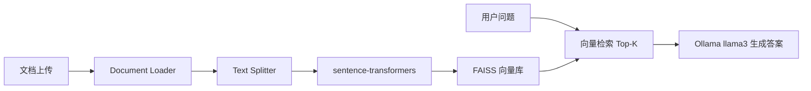

Local RAG 知识库是一个完全本地化的检索增强生成（RAG）项目，技术栈为 Python + LangChain + FAISS + sentence-transformers + Ollama，**无需任何 API Key**。

- 文档上传（txt / md / pdf / docx / csv）
- 文本切片
- 向量入库（FAISS 持久化）
- 相似度检索 + Ollama llama3 问答

## 项目结构

```
local_rag/
├── app.py                      # FastAPI 启动入口
├── cli.py                      # 命令行工具
├── requirements.txt            # Python 依赖
├── .env.example                # 环境变量示例（可选）
├── config/
│   └── settings.py             # 配置管理
├── core/
│   ├── document_loader.py      # 多格式文档加载
│   ├── text_splitter.py        # 文本切片
│   ├── document_processor.py   # 加载 + 切片编排
│   ├── embedding_service.py    # sentence-transformers 向量化
│   ├── vector_store.py         # FAISS 向量库
│   └── rag_chain.py            # 检索 + Ollama 问答链
├── services/knowledge_service.py
├── api/routes.py
└── data/
    ├── uploads/
    └── faiss_index/
```

## 环境要求

- Python 3.10+
- [Ollama](https://ollama.com/) 已安装并运行
- 无需 OpenAI / Claude / 任何云端 API Key

## 快速启动

### 1. 安装并启动 Ollama

```bash
# 安装 Ollama 后拉取 llama3 模型
ollama pull llama3

# 确认 Ollama 服务在运行（默认 http://localhost:11434）
ollama list
```

### 2. 安装 Python 依赖

```bash
cd local_rag
python3 -m venv .venv
source .venv/bin/activate
pip install -r requirements.txt
```

### 3. （可选）调整配置

```bash
cp .env.example .env
```

所有配置均有默认值，不创建 `.env` 也可直接运行。

### 4. 启动 API 服务

```bash
python app.py
```

服务地址：`http://127.0.0.1:8000`  
Swagger 文档：`http://127.0.0.1:8000/docs`

## CLI 使用示例

```bash
# 上传本地文件
python cli.py upload ./data/sample.txt

# 提问
python cli.py ask "LangChain 在本项目中的作用是什么？"

# 查看状态
python cli.py status

# 清空索引
python cli.py reset
```

## API 使用示例

```bash
curl -X POST "http://127.0.0.1:8000/api/upload" -F "file=@./data/sample.txt"

curl -X POST "http://127.0.0.1:8000/api/ask" \
  -H "Content-Type: application/json" \
  -d '{"question": "这份文档主要讲了什么？"}'
```

## 工作流程



## 配置说明

| 变量 | 说明 | 默认值 |
|------|------|--------|
| `EMBEDDING_MODEL` | sentence-transformers 模型 | `all-MiniLM-L6-v2` |
| `CHAT_MODEL` | Ollama 模型名 | `llama3` |
| `OLLAMA_BASE_URL` | Ollama 服务地址 | `http://localhost:11434` |
| `CHUNK_SIZE` | 切片大小 | `500` |
| `CHUNK_OVERLAP` | 切片重叠 | `50` |
| `RETRIEVAL_TOP_K` | 检索条数 | `4` |

## 注意事项

- 首次运行会自动下载 sentence-transformers 向量模型，需要网络连接。
- 问答前请确保 Ollama 已启动且已 `ollama pull llama3`。
- 若更换 Embedding 模型，请先 `python cli.py reset` 再重新上传文档。
- 若从旧版（OpenAI/Claude）迁移，旧 FAISS 索引维度可能不兼容，需 reset 后重建。
